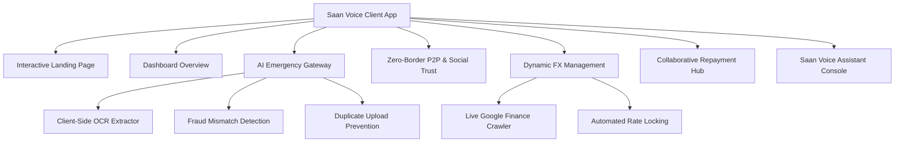

# Saan Voice - Application Documentation

Saan Voice is a premium, AI-driven emergency finance and zero-border cross-border payment platform. Designed with state-of-the-art glassmorphism styling, it leverages local P2P matching to eliminate cross-border wire fees, utilizes client-side OCR for instant emergency verification, locks currency rates against fluctuations, and features a hands-free AI voice command console.

---

## 1. High-Level Architecture & Stack

The application is structured as a single-page web app built on **Vite, React, TypeScript, and TailwindCSS**. 
- **Frontend Core**: React components handle individual modules (Overview, Payout, P2P matching, FX locking, Collaborative repayment, Voice assistant).
- **Backend / Crawler Proxy**: Integrated directly into [vite.config.ts](file:///c:/Users/Navya/OneDrive/Saan%20pay/Saan%20Voice/frontend/vite.config.ts) as server-side middleware, providing live rate scraping from Google Finance to bypass CORS limitations and eliminate paid API dependencies.
- **Styling**: Sleek dark-mode aesthetic (`#080C1E`) utilizing custom-defined gradients, glassmorphism cards (`bg-[#0D1527]/70`), and responsive layouts.

---

## 2. Core Feature Modules



### A. Dynamic & Interactive Landing Page ([LandingPage.tsx](file:///c:/Users/Navya/OneDrive/Saan%20pay/Saan%20Voice/frontend/src/components/LandingPage.tsx))
- **Live FX Converter Widget**: Connects directly to the custom crawler middleware, pulling live rates from Google Search.
- **Feature Spotlights**: Highlights platform pillars: Zero-Remittance Markups, Verified Emergency Collateral, and Voice Conversational UI.
- **Interactive Demos**: Live calculators demonstrating simulated fee savings compared to traditional wire transfers.

### B. Dashboard Overview ([DashboardOverview.tsx](file:///c:/Users/Navya/OneDrive/Saan%20pay/Saan%20Voice/frontend/src/components/DashboardOverview.tsx))
- **Financial Status Cards**: Visualizes total credit balance, locked rates count, total savings, and repaid amounts.
- **Exchange Rate Grid**: Lists real-time exchange rates (GBP to INR, AED, CAD, EUR, USD) fed by the crawler.
- **Transaction Ledger**: Displays recent payouts, locked FX contracts, and community repayments.

### C. AI Emergency Verification Gateway ([EmergencyPayout.tsx](file:///c:/Users/Navya/OneDrive/Saan%20pay/Saan%20Voice/frontend/src/components/EmergencyPayout.tsx))
- **Client-Side OCR Engine**: Employs an HTML5 `FileReader` stream parser to read textual uploads and extract raw ASCII string patterns from binary PDFs instantly.
- **Category Match Engine**: Validates text against category-specific keyword groups (e.g. Medical, Flight Delay, Tuition, Rent).
- **Anti-Fraud System**:
  - **Promotional Material Checker**: Instantly flags marketing words (`flyer`, `sale`, `coupon`, `promo`) and rejects claims.
  - **Duplicate Submission Scanner**: Tracks file fingerprints across sessions using local storage; flags files submitted by other simulated accounts (e.g. Rushi vs Aarav) to prevent duplicate receipt fraud.
- **Currency Routing Selector**: Allows selecting the payout currency (INR, AED, etc.) and updates allocation figures.
- **Payout Release Flow**: Automatically releases emergency credit upon scan clearance.

### D. Zero-Border Matching & Social Trust ([ZeroBorderP2P.tsx](file:///c:/Users/Navya/OneDrive/Saan%20pay/Saan%20Voice/frontend/src/components/ZeroBorderP2P.tsx), [SocialTrust.tsx](file:///c:/Users/Navya/OneDrive/Saan%20pay/Saan%20Voice/frontend/src/components/SocialTrust.tsx))
- **Zero-Border matching**: Links domestic payers sending money abroad with local receivers of funds, bypassing international bank wires.
- **Social Trust Circles**: Users invite friends/family as guarantors. More guarantors lower interest rates and raise credit limits, creating a localized community-backed loan structure.

### E. Dynamic FX Management System ([FXManagement.tsx](file:///c:/Users/Navya/OneDrive/Saan%20pay/Saan%20Voice/frontend/src/components/FXManagement.tsx))
- **Live Rate Locking**: Allows securing a specific rate for future transfers.
- **Trend Charts**: Renders historical rate lists scraped dynamically.
- **Trigger Alerts**: Automatically processes transfers when target rates match the Google Finance rate.

### F. Collaborative Repayment & Lending Hub ([CollaborativeRepay.tsx](file:///c:/Users/Navya/OneDrive/Saan%20pay/Saan%20Voice/frontend/src/components/CollaborativeRepay.tsx))
- **Split Repayments**: Family members contribute custom amounts in their local currency to help repay a user's emergency loan.
- **Fractional Ledger**: Tracks group repayment history and updates outstanding debt balances transparently.

### G. Hey Saan AI Voice Assistant ([VoiceAssistant.tsx](file:///c:/Users/Navya/OneDrive/Saan%20pay/Saan%20Voice/frontend/src/components/VoiceAssistant.tsx))
- **Vocal Command Engine**: Simulates speech processing to navigate pages, lock rates, or verify files.
- **Interactive Console**: Users speak or type queries (e.g. *"Lock rate for GBP to INR"* or *"Show me emergency tab"*), triggering dashboard tabs and actions hands-free.

---

## 3. Data Integration & Scraper Flow

```
[React App: fetchRealRates]
            │
            ▼ (GET /api/live-rates)
[Vite Dev Server: Custom Plugin Middleware]
            │
            ├─► Parallel requests (fetch)
            │   ├─► https://www.google.com/finance/quote/GBP-INR
            │   ├─► https://www.google.com/finance/quote/GBP-AED
            │   ├─► https://www.google.com/finance/quote/GBP-CAD
            │   ├─► https://www.google.com/finance/quote/GBP-EUR
            │   └─► https://www.google.com/finance/quote/GBP-USD
            │
            ▼ (Regex Extraction targeting class 'IHz7Sd' and jsname='Pdsbrc')
[Response Payload: JSON] ──► [React State Updates App-wide]
```
